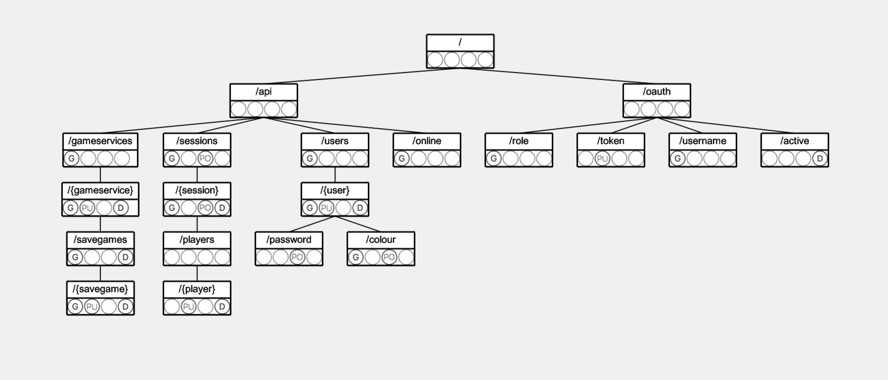

# LS API Documentation

This page documents how to access LS provided functionality.

## Resource Overview

Structured representation of the Lobby Service's REST resources and offered access methods:



Quick navigation:

 * [/api/online](#online)
 * [/api/users](#users) and subresource
 * [/api/gameservice](#game-services) and subresource
 * [/api/sessions](#sessions) and subresource
 * [/api/gameservices/{gameservice}/savegames](#savegames) and subresource
 * [/oauth](#authentication) and subresources

## ARC Configuration

The "[Advanced Rest Client](https://install.advancedrestclient.com/install)" is a tool for convenient REST API test access and code generators for various programming languages. All major platforms and [a browser plugin](https://chrome.google.com/webstore/detail/advanced-rest-client/hgmloofddffdnphfgcellkdfbfbjeloo) are supported.

 * Prepared ARC filed can be download in the individual sections below. View as RAW and safe to a ```*.arc``` file on your disk.
 * To import an ARC file, open the ARC program, then use the ```File -> Import Data...``` menu. Then select your ARC file.

## Access Details

The remainder of this page lists detailed endpoint descriptions of all LS resources.  
The following syntax is used:

 * Methods that require full authentication by OAuth2-token are printed **bold**.
 * Optional URL-, Header- or Body-parameters are printed *italic* 

 > **Note**: OAuth2 tokens often contain one or multiple "```+```" signs. If you transmit an OAuth2 token via URL-encoding, e.g. for method authentication, you must escape all occurrences of ```+``` to the URL-encoded representation: ```%2B```. Otherwise your token is not recognized and the associated request will be answered with a [```403``` (forbidden) HTTP status code](https://developer.mozilla.org/en-US/docs/Web/HTTP/Status/403).

---
### Debugging

[[Download sample ARC configuration](arc/ls-online.arc)]

 * /api/online
   * ```GET```: Retrieves an "alive flag" and tells the amount of registered users. Useful for debugging.
     * Curl:  
        ```
        curl -X GET http://127.0.0.1:4242/api/online
        ``` 
     * Produces: UTF8-String

---
### Users

[[Download sample ARC configuration](arc/ls-users.arc)]

 * /api/users
   * **GET**: Retreives list of all users (and details on them) from the LS's database.
     * Request-Parameters: ```access_token=...``` (admin role required)
     * Curl:  
        ```
        curl -X GET http://127.0.0.1:4242/api/users?access_token=4/GDgvfNvn8G65hx3c%2Badtgbano=
        ``` 
     * Produces: ```application/json; charset=utf-8```
        ```json
        [
            {
                "name": "admin",
                "password": "$2a$12$hB0DoJ2PAIEdUmWiQh.9d.f9IuO/L85ZY.Gxf/iHbnyTWgZM0zgS2",
                "preferredColour": "FF0000",
                "role": "ROLE_ADMIN"
            },
            {
                "name": "maex",
                "password": "$2a$12$6.McsTs654WOtJTB8ItKK.ARPo05Wv2ErCKiXKbXudvjE/EGJrZTy",
                "preferredColour": "CAFFEE",
                "role": "ROLE_PLAYER"
            },
            {...}
        ]
        ```  
 * /api/users/{users}
   * **GET**: Retreives list of a specific users (and details on the user) from the LS's database.
     * Request-Parameters: ```access_token=...``` (admin role required, or token of the requested user)
     * Curl:  
        ```
        curl -X GET http://127.0.0.1:4242/api/users/maex?access_token=4/GDgvfNvn8G65hx3c%2Badtgbano=
        ``` 
     * Produces: ```application/json; charset=utf-8```
        ```json
        {
            "name": "maex",
            "password": "$2a$12$6.McsTs654WOtJTB8ItKK.ARPo05Wv2ErCKiXKbXudvjE/EGJrZTy",
            "preferredColour": "CAFFEE",
            "role": "ROLE_PLAYER"
        }
        ```  
   * **PUT**: Adds a new user to the LS database.
     * Request-Parameters: ```access_token=...``` (admin role required)
     * Header-Parameters: ```Content-Type: application/json```
     * Request-Body:  
        ```json
        {
            "name": "Foo",
            "password": "abc_123ABC123",
            "preferredColour": "01FFFF",
            "role": "ROLE_PLAYER"
        }
        ```
     * Curl:  
        ```
        curl -X PUT --header 'Content-Type: application/json' --data '{"name":"Foo","password":"abc_123ABC123","preferredColour":"01FFFF","role":"ROLE_PLAYER"}' http://127.0.0.1:4242/api/users/Foo?access_token=4/GDgvfNvn8G65hx3c%2Badtgbano=
        ``` 
   * **DELETE**: Removes a user from the LS's database.
     * Request-Parameters: ```access_token=...``` (admin role required. Can not be applied on own profile)
     * Curl:  
        ```
        curl -X DELETE http://127.0.0.1:4242/api/users/Foo?access_token=4/GDgvfNvn8G65hx3c%2Badtgbano=
        ```  
        *Note: Admins can not delete themselves. Deleting admins furthmore implicitly deletes all associated game-servers and adherent sessions.*
 * /api/users/{users}/password
   * **POST**: Updates the password of an existing user.
     * Request-Parameters: ```access_token=...``` (admin role required, or token of the requested user)
     * Header-Parameters: ```Content-Type: application/json```
     * Request-Body:  
        ```json
        {
            "nextPassword": "abc123_ABC123",
            "oldPassword": "abc_123ABC123"
        }
        ```  
Note: ```oldPassword``` is not verified if the request was authorized by an admin-token.
     * Curl:  
        ```
        curl -X POST --header 'Content-Type: application/json' --data '{"oldPassword":"abc_123ABC123","nextPassword":"abc123_ABC123"}' http://127.0.0.1:4242/api/users/Foo/password?access_token=mda9H8EVn2IXGACvaFD1df8wdPE=
        ``` 
 * /api/users/{users}/colour
   * **GET**
     * Request-Parameters: ```access_token=...``` (admin role required, or token of the requested user)
     * Curl:  
        ```
        curl -X GET http://127.0.0.1:4242/api/users/Foo/colour?access_token=mda9H8EVn2IXGACvaFD1df8wdPE=
        ``` 
     * Produces: ```application/json; charset=utf-8```
        ```json
        {"colour":"CAFFEE"}
        ```
   * **POST** Changes the preferred colour of a LS user.
     * Request-Parameters: ```access_token=...``` (admin role required, or token of the requested user)
     * Header-Parameters: ```Content-Type: application/json```
     * Request-Body:  
        ```json
        {"colour":"DECAFF"}
        ```
     * Curl:  
        ```
        curl -X POST --header 'Content-Type: application/json' --data '{"colour":"DECAFF"}' http://127.0.0.1:4242/api/users/Foo/colour?access_token=mda9H8EVn2IXGACvaFD1df8wdPE=
        ``` 

---
### Game-Services

[[Download sample ARC configuration](arc/ls-gameservices.arc)]

 * /api/gameservices
   * GET: Retreive a list with the names of all registered gameservices as name / displayName bundles
     * Curl:  
        ```
        curl -X GET http://127.0.0.1:4242/api/gameservices
        ``` 
     * Produces: ```application/json; charset=utf-8```
        ```json
        [ {"name":"ColtExpress", "displayName":"Colt Express"}, {"name":"Acquire", "displayName": "Acquire"}, {"name":"PowergridQuebec", "displayName":"Powergrid Québec"} ]
        ```
 * /api/gameservices/{gameservice}
   * GET: Retrieve details on a previously registered Game-Service
     * Curl:  
        ```
        curl -X GET http://127.0.0.1:4242/api/gameservices/DummyGame1
        ``` 
     * Produces: ```application/json; charset=utf-8```
        ```json
        {
            "location": "http://127.0.0.1:4243/DummyGameService",
            "maxSessionPlayers": 5,
            "minSessionPlayers": 3,
            "name": "DummyGame1",
            "displayName": "Dummy Game 1",
            "webSupport": "true"
        }
        ```  
        *Note: If the server registration occurred in phantom (p2p) mode, the location string is empty. Instead, the location of all clients is then maintained per session.*
   * **PUT**: Registers a new Game-Service at the LS.
     * Request-Parameters: ```access_token=...``` (service role required)
     * Header-Parameters: ```Content-Type: application/json```
     * Request-Body:  
        ```json
        {
            "location": "http://127.0.0.1:4243/DummyGameService",
            "maxSessionPlayers": 5,
            "minSessionPlayers": 3,
            "name": "DummyGame1",
            "displayName": "Dummy Game 1",
            "webSupport": "true"
        }
        ```  
        *Note: The location string can be left empty, to indicate that the clients will connect in P2P mode. In that case clients must provide their location when creating / joining a session. Furthermore the Lobby-Service will suppress all outbound notifications to the phantom game-server. Clients can observe the session status with async update requests on the individual sessions instead.*
     * Curl:  
        ```
        curl -X PUT --header 'Content-Type: application/json' --data '{"name":"DummyGame1","displayName":"Dummy Game 1","location":"http://127.0.0.1:4243/DummyGameService","minSessionPlayers":3,"maxSessionPlayers":5, "webSupport":"true"}' http://127.0.0.1:4242/api/gameservices/DummyGame1?access_token=dA/1to5bFiRvqTem0eiUzY2FITw=
        ``` 
   * **DELETE**: Removes a previously registered gameservice. Implicitly removes all corresponding savegames and sessions. Also sends a [quit request](game-dev.md#callbacks) to all affected running sessions.
     * Request-Parameters: ```access_token=...``` (admin role or matching service role required.)
     * Curl:  
        ```
        curl -X DELETE http://127.0.0.1:4242/api/gameservices/DummyGame1?access_token=BRReiLGVvB6C9vSX%2BBUMvxomveg=
        ``` 

---
### Sessions

[[Download sample ARC configuration](arc/ls-sessions.arc)]

 * /api/sessions
   * GET: Retrieves details on all sessions. Clients can send a hash of the previous response payload, to advised the LS to withhold reply until a relevant update or timeout occurred.
     * Request-Parameters: *```hash=...```* (enables [long-polling](https://github.com/kartoffelquadrat/AsyncRestLib#client-long-poll-counterpart))
     * Curl:  
        ```
        curl -X GET "http://127.0.0.1:4242/api/sessions
        ``` 
     * Produces: ```application/json; charset=utf-8```
        ```json
        {
            "sessions": {
                "6866248315071836551": {
                    "creator": "maex",
                    "gameParameters": {
                        "location": "http://127.0.0.1:4243/FunnyDemoGameServer",
                        "maxSessionPlayers": 2,
                        "minSessionPlayers": 2,
                        "name": "DummyGame1",
                        "webSupport": "true"
                    },
                    "launched": false,
                    "players": [
                        "maex"
                    ],
                    "playerLocations": {},
                    "savegameid": ""
                },
                "9709348315071883671": {...}
            }
        }
        ```
        *Note: If the server was registered in phantom (p2p) mode the server-location field of adherent sessions is empty. Instead the playerLocations collection holds a location string per player, e.g. "maex":"192.168.1.42".*
   * **POST**: Creates a new session. Can be a fork of a previously registered savegame if the corresponding body-field is not empty. Restoring from a savegame alters the default minimum and maximum player fields to match the specified savegame.
     * Request-Parameters: ```access_token=...``` (user role required)  
Optional, for P2P clients: ```location=___.___.___.___``` (must be a valid IP address)
     * Header-Parameters: ```Content-Type: application/json```
     * Request-Body:
        ```json
        {
            "creator": "maex",
            "game": "DummyGame1",
            "savegame": "funnysavegameid42"
        }
        ```
        *Note: If the server was registered in phantom (p2p) mode the creator must additionally provide the own location for P2P discovery. This is provided as an optional request-parameter "location".*
     * Curl:  
        ```
        curl -X POST --header 'Content-Type: application/json' --data '{"game":"DummyGame1", "creator":"maex", "savegame":""}' http://127.0.0.1:4242/api/sessions?access_token=q64bvh9iNSZK5eQkUUzaE368u94=
        ``` 
     * Produces: UTF8-String, encoding a the id of the newly created session (positive long)
 * /api/sessions/{session}
   * GET: Retrieves details on a specific session. Clients can send a hash of the previous respnse payload, to advised the LS to withhold reply until a relevant update or timeout occurred.
     * Request-Parameters: *```hash=...```* (enables [long-polling](https://github.com/kartoffelquadrat/AsyncRestLib#client-long-poll-counterpart))
     * Curl:  
        ```
        curl /dev/stdout -X GET http://127.0.0.1:4242/api/sessions/6866248315071836551
        ``` 
     * Produces: ```application/json; charset=utf-8```
        ```json
        {
            "creator": "maex",
            "gameParameters": {
                "location": "http://127.0.0.1:4243/FunnyDemoGameServer",
                "maxSessionPlayers": 2,
                "minSessionPlayers": 2,
                "name": "DummyGame1",
                "webSupport": "true"
            },
            "launched": false,
            "players": [
                "maex"
            ],
            "playerLocations": {},
            "savegameid": ""
        }
        ```
        *Note: If the server was registered in phantom (p2p) mode the server-location field is empty. Instead the playerLocations collection holds a location string per player, e.g. "maex":"192.168.1.42".*
   * **POST**: Launches a session. This send implicly a [launch request] to the associated game-service.
     * Request-Parameters: ```access_token=...``` (must be token of session creator)  
Optional, for P2P clients: ```location=___.___.___.___``` (must be a valid IP address)  
      *Note: If the server was registered in phantom (p2p) mode the creator must additionally provide the own location for P2P discovery. This is provided as an optional request-parameter "location".*
     * Curl:  
        ```
        curl -X POST http://127.0.0.1:4242/api/sessions/6866248315071836551?access_token=q64bvh9iNSZK5eQkUUzaE368u94=
        ```
   * **DELETE**: Removes a session. If the session was already launched a [quit request](...) is sent to the associated game-service.
     * Request-Parameters: ```access_token=...``` (admin role required, or token owner is creator of session)
     * Curl:  
        ```
        curl -X DELETE http://127.0.0.1:4242/api/sessions/6866248315071836551?access_token=q64bvh9iNSZK5eQkUUzaE368u94=
        ``` 
 * /api/sessions/{session}/players/{player}
   * **PUT**: Adds a player to an unlaunched session.
     * Request-Parameters: ```access_token=...``` (player role required)
     * Curl:  
        ```
        curl -X PUT http://127.0.0.1:4242/api/sessions/6866248315071836551/players/joerg?access_token=WtZNwT5H/CE2q4coFAGusPqF2wM=
        ``` 
   * **DELETE** Removes a player from an unlaunched session.
     * Request-Parameters: ```access_token=...``` (player role required)
     * Curl:  
        ```
        curl -X DELETE "http://127.0.0.1:4242/api/sessions/6866248315071836551/players/joerg?access_token=WtZNwT5H/CE2q4coFAGusPqF2wM=
        ``` 

---
### Savegames

[[Download sample ARC configuration](arc/ls-savegames.arc)]

 * /api/gameservices/{gameservice}/savegames
   * **GET**: Retrieves details on all savegames for a specific registered game-service.
     * Request-Parameters: ```access_token=...``` (admin / player)
     * Curl:  
        ```
        curl -X GET http://127.0.0.1:4242/api/gameservices/DummyGame1/savegames?access_token=7Ujijb4y/ApGL5P7iHMA/Nl/sag=
        ``` 
     * Produces: ```application/json; charset=utf-8```
        ```json
        [
            {
                "gamename": "DummyGame1",
                "players": [
                    "maex",
                    "ryan"
                ],
                "savegameid": "XYZ42"
            },
            {...}
        ]
        ```

   * **DELETE**: Removes all savegames registered for a specific game-service. Implicitly removes all unlaunched sessions forked of the removed savegames.
     * Request-Parameters: ```access_token=...``` (admin, must be the admin who registered the game-service)
     * Curl:  
        ```
        curl -s -D /dev/stdout -X DELETE http://127.0.0.1:4242/api/gameservices/DummyGame1/savegames?access_token=4Eaxe1eijCMzQdZJzmq5UHMgCz0=
        ``` 

 * /api/gameservices/{gameservice}/savegames/{savegame}
   * **GET**: Retrieves details on a specific previously registered savegame.
     * Request-Parameters: ```access_token=...``` (admin / player)
     * Curl:  
        ```
        curl -s -D /dev/stdout -X GET http://127.0.0.1:4242/api/gameservices/DummyGame1/savegames/XYZ42?access_token=BRReiLGVvB6C9vSX%2BBUMvxomveg=
        ``` 
     * Produces: ```application/json; charset=utf-8```
        ```json
            {
                "gamename": "DummyGame1",
                "players": [
                    "maex",
                    "ryan"
                ],
                "savegameid": "XYZ42"
            }
        ```
   * **PUT**: Registers a savegame at the LS.
     * Request-Parameters: ```access_token=...``` (admin, must be the admin who registered the game-service)
     * Header-Parameters: ```Content-Type: application/json```
     * Request-Body:  
        ```json
        {
        "gamename": "DummyGame1",
        "players": [
            "maex",
            "ryan"
        ],
        "savegameid": "XYZ42"
        }
        ```
     * Curl:  
        ```
        curl -X PUT --header 'Content-Type: application/json' --data '{"players":["maex", "ryan"], "gamename":"DummyGame1", "savegameid":"XYZ42"}' http://127.0.0.1:4242/api/gameservices/DummyGame1/savegames/XYZ42?access_token=BRReiLGVvB6C9vSX%2BBUMvxomveg=
        ``` 
   * **DELETE**: Removes a previously registered savegame. Implicitly removes all unlaunched sessions, forked from this savegame.
     * Request-Parameters: ```access_token=...``` (admin, must be the admin who registered the game-service)
     * Curl:  
        ```
        curl -s -D /dev/stdout -X DELETE http://127.0.0.1:4242/api/gameservices/DummyGame1/savegames/XYZ42?access_token=4Eaxe1eijCMzQdZJzmq5UHMgCz0=
        ``` 

---
### Authentication

[[Download sample ARC configuration](arc/ls-oauth2.arc)]

 * /oauth/token
   * ```POST```: Creates, registers and returns a new OAuth2-Token and a corresponding Renew-Token.
     * Request-Parameters: ```grant_type=password```, ```username=...```, ```password=...```
     * Alternative Request-Parameters (token renewal): ```grant_type=refresh_token```, ```refresh_token=...```
     * Authentication: ```bgp-client-name:bgp-client-pw```
     * Curl:  
        ```
        curl -X POST --user bgp-client-name:bgp-client-pw "http://127.0.0.1:4242/oauth/token?grant_type=password&username=admin&password=admin"
        ```  
        alternatively you can pass the credentials as body data. (Body encoding follows urlencoded syntax. This means any plus sign occurrences in the password string must still be escaped to ```%2B```):  
        ```
        curl -X POST --user bgp-client-name:bgp-client-pw --data "grant_type=password&username=admin&password=admin" "http://127.0.0.1:4242/oauth/token"
        ```
     * Produces: ```application/json; charset=utf-8```
        ```json
        {
            "access_token": "dA/1to5bFiRvqTem0eiUzY2FITw=",
            "expires_in": 1800,
            "refresh_token": "D64WQktg5o9dIy45p+Ds+z9OaVA=",
            "scope": "read write trust",
            "token_type": "bearer"
        }
        ```
 * /oauth/role
   * **```GET```**: Resolves an OAuth2 token provided as request parameter to the account owner's role priviledges.
     * Request-Parameters: ```access_token=...```
     * Curl:  
        ```
        curl -X GET http://127.0.0.1:4242/oauth/role?access_token=37S8hhdMCdXupIatPm82xJpXXas=
        ```
     * Produces: ```application/json; charset=utf-8```
        ```json
        [
            {
                "authority": "ROLE_ADMIN"
            }
        ]
        ```  
	or alternatively: ```ROLE_PLAYER```
 * /oauth/username
   * **```GET```**: Resolves an OAuth2 token provided as request parameter to the account owner's name.
     * Request-Parameters: ```access_token=...```
     * Curl:  
        ```
        curl -X GET http://127.0.0.1:4242/oauth/username?access_token=37S8hhdMCdXupIatPm82xJpXXas=
        ```
     * Produces: UTF8-String
 * /oauth/active
   * **```DELETE```**: Deleting this resource revokes the parameter-provided OAuth2 token and the associated renew-token.
     * Request-Parameters: ```access_token=...```
     * Curl:  
        ```
        curl -X DELETE http://127.0.0.1:4242/oauth/active?access_token=37S8hhdMCdXupIatPm82xJpXXas=
        ```


